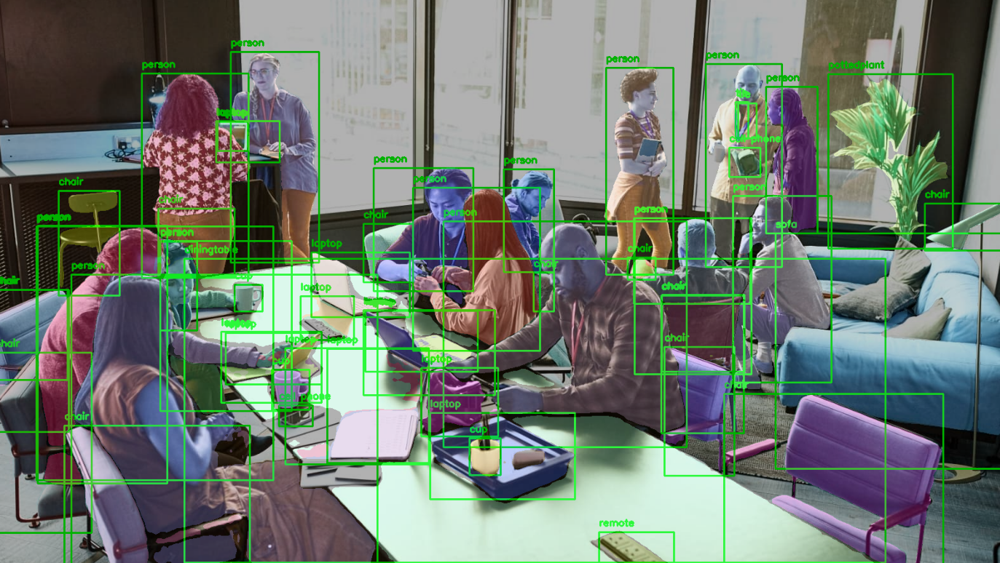
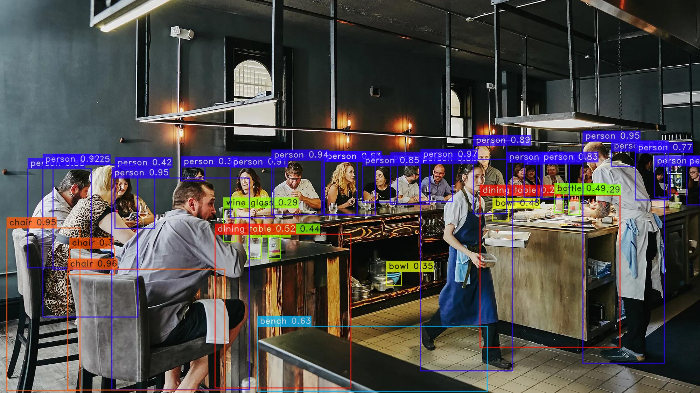
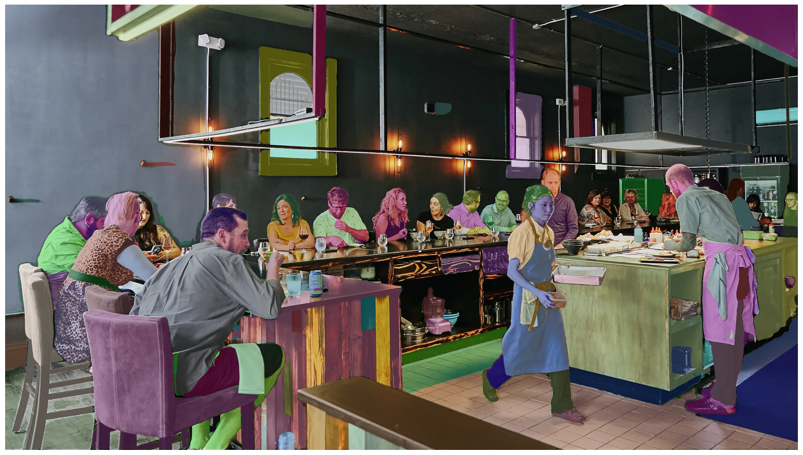

# Object Detection & Image Segmentation with YOLO-NAS + SAM

## Overview

[GitHub](https://github.com/JacobJ215/YOLO-NAS-SAM/)

This project demonstrates how to perform object detection and image segmentation using YOLO-NAS for object detection and SAM for image segmentation. YOLO-NAS developed by DeciAi is a state-of-the-art object detection model optimized for both accuracy and low-latency inference. SAM, on the other hand, is a powerful segmentation model developed by Meta AI.

## Technologies Used
- Python
- OpenCV
- PyTorch
- Numpy
- Matplotlib

## YOLO-NAS Overview

**YOLO-NAS, short for You Only Look Once with Neural Architecture Search,** is a cutting-edge object detection model optimized for both accuracy and low-latency inference. Developed by Deci, YOLO-NAS employs state-of-the-art techniques like Quantization Aware Blocks and selective quantization for superior performance. It sets a new standard for state-of-the-art (SOTA) object detection, making it an ideal choice for a wide range of applications including autonomous vehicles, robotics, and video analytics.

### Unique Features of YOLO-NAS
- Utilizes Quantization Aware Blocks for efficient inference without sacrificing accuracy.
- Incorporates AutoNAC technology for optimal architecture design, balancing accuracy, speed, and complexity.
- Supports INT8 quantization for unprecedented runtime performance.
- Employs a hybrid quantization method that selectively quantizes certain parts of the model, reducing information loss and balancing latency and accuracy.
- Pre-training regimen includes automatically labeled data, self-distillation, and large datasets.
- Available under an open-source license with pre-trained weights for research use on SuperGradients, Deci’s PyTorch-based computer vision training library.

### YOLO-NAS architecture 
- Quantization-aware blocks: These blocks are designed to be quantized efficiently, which can improve performance and reduce latency.
- Selective quantization: This technique allows for quantization of specific layers of the model without sacrificing accuracy.
- Attention mechanism: This mechanism allows the model to focus on the most important parts of an image, which can improve accuracy and reduce inference time.

### Training Details
YOLO-NAS undergoes a multi-phase training process that includes pre-training on Object365, COCO Pseudo-Labeled data, Knowledge Distillation (KD), and Distribution Focal Loss (DFL). The model is meticulously trained on Objects365, a comprehensive dataset with 2 million images and 365 categories, for 25-40 epochs, ensuring robust performance.

## SAM Overview

**SAM (Segment Anything Model)** is a large language model from Meta AI that can be used to segment objects in images with high accuracy. SAM is trained on a massive dataset of images and segmentation masks, and it can be used to generate masks for all objects in an image, or for specific objects or regions of interest.

### Supported Prompts
- Foreground/background points
- Bounding box
- Mask

*Note: Text prompts are explored in the research paper but the capability is not released.*

### Model Structure
- A ViT-H image encoder that runs once per image and outputs an image embedding.
- A prompt encoder that embeds input prompts such as clicks or boxes.
- A lightweight transformer-based mask decoder that predicts object masks from the image embedding and prompt embeddings.

### Model Size
- The image encoder has 632M parameters.
- The prompt encoder and mask decoder have 4M parameters.

### Training Data
The model was trained on the SA-1B dataset.

### Efficient & Flexible Design
SAM is designed to be efficient enough to power its data engine. It is decoupled into a one-time image encoder and a lightweight mask decoder that can run in a web browser in just a few milliseconds per prompt.

*Note: SAM is still under development, but it has the potential to revolutionize the way we interact with images and videos.*
